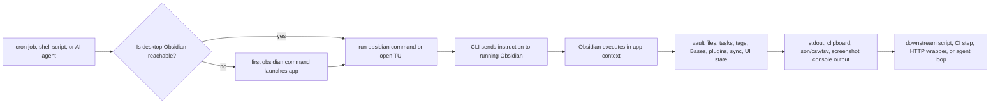

# Obsidian CLI Deep Research Report

## Executive summary

Obsidian CLI is an official desktop command-line interface that lets a terminal session control a running Obsidian app. As of the current official help page, the recommended requirement is the latest Obsidian installer version, currently documented as **1.12.7+**, with the CLI enabled from **Settings → General → Command line interface**. The CLI is **not** the same thing as Obsidian Headless: the desktop CLI talks to the running desktop app, whereas Headless is a separate npm-installed client for Sync and Publish without the GUI. citeturn26search1turn7search0turn7search1turn7search2turn37view0

The command surface is broad and spans everyday note operations, vault queries, task/tag inspection, file history, sync control, Bases, templates, themes, workspaces/tabs, and developer automation. The **official help page** is the most reliable source for current syntax. The marketing page at `/cli` is useful for understanding positioning and use cases, but some example invocations there are simplified and do not always match the parameter names documented on the help page, so scripts should follow the help page rather than the landing page whenever there is a conflict. citeturn10search0turn28search0turn41view3

Historically, the CLI arrived first in **1.12.0 Desktop catalyst** on **February 10, 2026**, then rolled into the public **1.12 Desktop** release on **February 27, 2026**. Between 1.12.1 and 1.12.7, Obsidian shipped multiple CLI-specific fixes and behavior changes, including rules around `vault=` placement, better help output, a `--help` alias, Unicode fixes, Windows detection fixes, faster CLI startup using a dedicated binary, and TUI autocomplete improvements. In practice, this means the CLI matured quickly, and reports or scripts written against early February 2026 behavior may be outdated. citeturn36view2turn11search2turn12search0turn12search3turn33search0turn33search3turn37view0

From a security perspective, the CLI inherits the trust boundary of the desktop app. Obsidian itself is local-first and privacy-oriented, but the desktop app can run community plugins, and Obsidian’s own plugin-security documentation states that community plugins inherit Obsidian’s effective access levels and cannot be reliably permission-scoped. That matters because the CLI can invoke plugin-registered commands and developer commands such as JavaScript evaluation and DevTools/Chrome DevTools Protocol actions. Obsidian documents broader client security audits by entity["company","Cure53","security firm"], but I did **not** find a CLI-specific security audit or CLI-specific permission model in the official materials, so those details remain unspecified. citeturn13search0turn13search1turn41view3

The CLI is most compelling for three use cases: deterministic personal automation, plugin/theme development, and agent/tool integrations. Its biggest operational risks today are installer/package-manager mismatch, desktop-versus-headless confusion, inconsistent exit-code semantics reported by users in automation contexts, quoting/control-character edge cases, and packaging-layer issues in ecosystems such as Flatpak or Windows shims. The strongest practical recommendation is to treat the CLI as a **GUI-aware automation layer**, not as a general-purpose headless file tool. citeturn26search1turn24view5turn30search0turn24view2turn25view0turn40search0

## Scope and source hierarchy

This report prioritizes sources in the following order: the official Obsidian help page for current syntax and behavior; official changelog entries for version history and regressions/fixes; official developer documentation and official repositories for adjacent context; GitHub repositories and issues for integrations and edge cases; then forum posts, blogs, and YouTube demos for real-world usage patterns. When official and community sources disagree, this report follows the official help/changelog pages. citeturn26search1turn11search2turn36view2turn37view0

A practical consequence of that hierarchy is that the `/cli` landing page is treated as **illustrative**, not normative. For example, that page shows examples like `plugin:reload my-plugin`, `dev:screenshot file=shot.png`, `eval "…"`, and `files sort=modified limit=5 --copy`, while the help page documents `plugin:reload id=my-plugin`, `dev:screenshot path=…`, `eval code="…"`, and does **not** document `sort=` or `limit=` on the `files` command in the extracted help reference. For automation, the help page syntax is the safer authority. citeturn28search0turn10search0turn41view3

Community coverage is already substantial on the Obsidian Forum, in independent blog posts, and on YouTube. By contrast, public discoverability on Stack Overflow appears sparse for the **official** Obsidian CLI specifically: indexed searches during this research produced mostly adjacent Obsidian questions rather than dedicated official-CLI threads. That does not mean no examples exist, only that Stack Overflow is not yet the main public knowledge base for this feature. citeturn34view0turn34view1turn16search1turn16search5turn15search1turn15search3turn15search6

## Commands and syntax

The documented command model is conventional but opinionated. Obsidian supports one-shot commands and a TUI. Commands use `parameter=value` syntax, boolean flags with no value, multiline content encoded with `\n` and `\t`, and a first-position `vault=` selector when you want to force a specific vault. `file=` uses Obsidian-style name resolution, while `path=` requires an exact vault-root-relative path. The TUI adds autocomplete, history, reverse search, and shell-like shortcuts such as `Ctrl+R`, `Tab`, `Ctrl+L`, and `Ctrl+C`/`Ctrl+D`. citeturn26search1turn41view3

The table below synthesizes the official help page and related official materials into the command families most relevant for actual use. Exact parameter names come from the help page where available; developer examples come from the help page’s developer block and the primary-source `obsidian-skills` repository. citeturn10search0turn41view2turn41view3turn20view4

| Command family | Representative commands | High-value parameters and flags | Main use |
|---|---|---|---|
| General | `help`, `version`, `reload`, `restart` | `<command>`, `--help` alias | Discover commands, verify install, refresh app |
| Files and folders | `file`, `files`, `folder`, `folders`, `open`, `create`, `read`, `append`, `prepend`, `move`, `rename` | `vault=`, `file=`, `path=`, `content=`, `overwrite`, `open`, `newtab`, `inline`, `total` | CRUD and navigation with Obsidian-aware semantics |
| Search, tags, tasks | `search`, `search:context`, `tags`, `tag`, `tasks`, `task` | `query=`, `path=`, `format=`, `counts`, `verbose`, `total`, `done`, `todo`, `status=`, `daily`, `active` | Vault querying, grep-style context, task/tag inventory |
| Daily notes and history | `daily`, `daily:path`, `daily:read`, `daily:append`, `daily:prepend`, `diff`, `history:*` | `paneType=`, `content=`, `version=`, `from=`, `to=`, `filter=local|sync` | Daily workflows, recovery, version comparison |
| Sync and Bases | `sync`, `sync:*`, `bases`, `base:views`, `base:create`, `base:query` | `on`, `off`, `format=json|csv|tsv|md|paths`, `view=`, `name=`, `content=` | In-app sync control and Bases automation |
| Templates, themes, workspace | `templates`, `template:read`, `template:insert`, `themes`, `theme`, `theme:set`, `workspace:*`, `tabs`, `tab:open`, `recents` | `resolve`, `name=`, `versions`, `ids`, `group=`, `view=` | Template application, UI state, tab/workspace scripting |
| Developer and plugin tooling | `devtools`, `dev:debug`, `dev:cdp`, `dev:errors`, `dev:screenshot`, `dev:console`, `dev:css`, `dev:dom`, `plugin:reload`, `eval` | `on`, `off`, `method=`, `params=`, `path=`, `limit=`, `level=`, `selector=`, `prop=`, `id=`, `code=` | Plugin/theme development, automated testing, agent-driven debugging |

The most important cross-cutting syntax rules are easy to miss and matter disproportionately in scripts. `vault=` must be first; `--copy` copies output to the clipboard; `--help` is a documented alias since 1.12.2; and since 1.12.2 the CLI ignores **unrecognized** flags that begin with `--`. That last change is convenient for compatibility, but it also makes typo’d long flags easier to miss in automation. The official materials do **not** explicitly document a `--version` alias, so that remains unspecified. citeturn10search0turn36view3

Two analytical cautions are worth calling out. First, the slogan on the landing page — “Anything you can do in Obsidian you can do from the command line” — should be read as directionally true, not literally exhaustive, because current forum feature requests still ask for stdin support, structured JSON output, easier frontmatter manipulation, command execution by **name** instead of ID, and better cross-vault actions. Second, several parameters demonstrated on the marketing page are either simplified or undocumented relative to the help page. In other words, the command surface is already large, but the product is still converging. citeturn28search0turn24view4turn40search1

## Installation and platform differences

Current official installation is built into the Obsidian desktop app, not distributed as a separate package. The process is: install a recent Obsidian installer, enable the CLI in settings, register it to your PATH, and restart the terminal. Since 1.12.7, the installer bundles a dedicated CLI binary rather than reusing the Electron binary directly, which the release notes say results in significantly faster terminal interactions. citeturn26search1turn37view0

The table below condenses the official platform-specific registration model plus the most relevant ecosystem caveats that surfaced in primary and community sources. Official docs dominate the registration column; forum and issue references are used only for package-manager caveats. citeturn10search0turn24view8turn25view0turn40search0

| Platform | Official registration model | Permissions and shell details | Common caveats |
|---|---|---|---|
| macOS | Creates a symlink at `/usr/local/bin/obsidian` pointing to the bundled CLI binary | Requires administrator approval via system dialog | Older beta/public setups used `~/.zprofile`; stale entries can linger; package-manager installs and sandboxed launch contexts have produced “helper app” and re-registration issues |
| Windows | Uses an `Obsidian.com` terminal redirector next to `Obsidian.exe` so a GUI app can speak to terminal I/O correctly | PATH change is per-user; terminal restart required | Shim-based package managers can spawn extra console windows; several Windows parsing/detection bugs were fixed in 1.12.2–1.12.4 |
| Linux | Copies the CLI binary to `~/.local/bin/obsidian` because some install methods are not stably symlinkable | Requires `~/.local/bin` in `PATH` | Community-packaged Flatpak builds can sandbox the CLI socket and break discovery; official maintainers note Flatpak is community-maintained rather than first-party |

One of the most important platform distinctions is not OS-specific but architectural: **desktop CLI versus Headless**. If you want to script against Obsidian’s live desktop context — active vault, plugin commands, UI/workspace state, developer tools — use `obsidian`. If you want server-friendly Sync or Publish without a GUI, use Obsidian Headless via `npm install -g obsidian-headless`, which currently requires Node.js 22+ and subscriptions for the relevant services. The two products are complementary, not interchangeable. citeturn7search0turn7search1turn7search2turn26search1

Security and permissions are partly documented and partly unspecified. What is documented is that Obsidian is local-first, broader desktop/mobile clients have undergone third-party audits, and community plugins are powerful enough to access local files, the network, and even install additional programs. What is **not** documented in the CLI materials is a separate CLI authentication flow, per-command permission prompts, any socket ACL model exposed to users, or an environment-variable/API-key model for the **desktop** CLI itself. As a result, the safest assumption is that the CLI inherits whatever trust you have already given the running app and its plugin set. citeturn13search0turn13search1turn41view3

Package-manager nuance deserves emphasis because it is a recurring failure mode. Users have reported friction with older entity["company","Homebrew","macos package manager"] installs on macOS, shim behavior in entity["organization","ScoopInstaller","windows package manager"] on Windows, and socket isolation in community Flatpak builds on Linux. The official troubleshooting playbook — upgrade installer, toggle CLI off/on, let Obsidian re-register PATH, restart terminal — is the correct first response before deeper debugging. citeturn24view0turn25view0turn40search0turn26search1

## Automation, scripting, and integrations

The CLI is strongest when you want **Obsidian-aware** automation rather than raw file edits. In that role it gives you three advantages over ad hoc shell scripts that mutate Markdown directly: it can reuse Obsidian’s own file-resolution logic, it can act on app concepts such as daily notes, tasks, tags, Bases, sync history, workspaces, and developer tools, and it can trigger plugin-registered commands or developer workflows inside the real application context. That is precisely why both the official help page and community guides frame the CLI as a bridge to scripting, cron jobs, and agentic tools. citeturn26search1turn28search0turn34view0turn34view2turn20view4

The following flowchart shows the automation pipeline that best matches the official desktop CLI design. It emphasizes that the CLI is a front end to a desktop app context rather than a standalone vault parser. The shape of this pipeline is supported by the help page, the Headless distinction page, and third-party wrappers built on top of the official CLI. citeturn26search1turn7search0turn20view0



Three script patterns cover most real deployments. The first is a daily-note routine. The second is a plugin-development loop. The third is a small Windows verification workflow. These syntax forms follow the official help page and primary-source developer references rather than the simplified landing-page examples. citeturn10search0turn41view3turn20view4

```bash
#!/usr/bin/env bash
set -euo pipefail

# Deterministic daily-note automation in a named vault
obsidian vault="Work" daily
obsidian vault="Work" daily:append content="- [ ] Review inbox"
obsidian vault="Work" daily:append content="- [ ] Check calendar"
obsidian vault="Work" tasks daily todo verbose
obsidian vault="Work" tags counts
```

```bash
#!/usr/bin/env bash
set -euo pipefail

# Plugin development loop
obsidian vault="Plugin Dev" plugin:reload id=my-plugin
obsidian vault="Plugin Dev" dev:errors
obsidian vault="Plugin Dev" dev:console level=error
obsidian vault="Plugin Dev" dev:screenshot path="artifacts/obsidian.png"
obsidian vault="Plugin Dev" dev:dom selector=".workspace-leaf" text
```

```powershell
# Windows verification / structured export
Get-Command obsidian
obsidian version
obsidian vault="Notes" search query="status::active" format=json | Set-Content active.json
obsidian vault="Notes" search:context query="meeting notes" path="Projects"
```

The official CLI also has a lively third-party ecosystem. The most direct extension is `obsidian-cli-rest`, which exposes official CLI commands as a local HTTP API and MCP server and defaults to localhost with API-key authentication. `obsidian-skills` packages usage guidance for agent frameworks and explicitly demonstrates command patterns like `plugin:reload`, `dev:errors`, `dev:screenshot`, and `dev:dom`. The `Obsidian LLM Plugin` takes a different approach: it embeds external AI CLIs such as Claude, Codex, OpenCode, and Gemini directly inside the vault experience. Separately, launcher/terminal plugins such as **Open in Terminal** and **Terminal for Obsidian** make it easier to start external CLIs or run shells at the vault root from within Obsidian. citeturn20view0turn19search5turn20view4turn21view1turn23view2turn23view1turn23view3

There is also a growing family of adjacent command-line tools that are **not** the official desktop CLI. `notesmd-cli` explicitly renamed itself from “Obsidian CLI” after the official release and positions itself as a terminal-only, direct-file tool that does **not** require the Obsidian app to be running. `obsidian-vault-cli` offers 100+ direct file-access commands and can work alongside `obsidian-skills`. A small Python bridge, `py-wrapper-for-obsidian-cli`, wraps the official CLI for Python usage. These tools can be very useful, but their model is different: they sit outside the GUI trust/runtime model and therefore do not automatically inherit Obsidian’s app-level semantics in the same way the official desktop CLI does. citeturn20view1turn20view2turn19search4turn35search0

## Limitations, bugs, and troubleshooting

The central limitation is architectural: the desktop CLI is **not headless**. If Obsidian is not already running, the first command launches it. That behavior is explicitly documented, is confusing to some users who expect a pure CLI failure mode, and is the reason community members keep asking for a “running?” check or a separate pure launcher/CLI split. This is also why package wrappers or sandboxed agent environments can fail in surprising ways: the CLI is trying to rendezvous with a desktop app context, not just parse files on disk. citeturn26search1turn24view5turn9view2turn24view8

The table below summarizes the most important operational limitations and bug classes that surfaced in official release notes, forum posts, and GitHub issues. Community sources are labeled as such conceptually, but Obsidian’s own changelog remains the authority on what is fixed versus merely reported. citeturn12search3turn33search0turn33search3turn37view0turn30search0turn24view2turn24view3turn39search0turn40search0turn25view0

| Issue class | What the evidence shows | Practical implication | Safer practice |
|---|---|---|---|
| Installer mismatch | Current docs require latest installer; 1.12.4 added warning for outdated installer | App version alone may not be enough | Upgrade installer, then re-register CLI |
| Early-release behavior churn | 1.12.1–1.12.7 changed syntax/behavior and fixed multiple regressions | Old examples can break or mislead | Check help output on the installed version |
| Exit-code semantics | Forum reports show failures can still exit `0` and print to stdout | `set -e` is not always sufficient | Validate stdout/stderr content semantically |
| Quoting and control characters | Maintainer acknowledged unsupported single-quote/control-character cases | Raw LaTeX/backslash-heavy `content=` payloads can misbehave | Prefer direct file writes or dedicated commands |
| External-write race conditions | Reported `property:set` no-op on externally written files in automated flows | Disk writes outside Obsidian may outrun indexing | Prefer doing the write through CLI or insert a synchronization/wait step |
| Frontmatter bootstrapping pitfall | A help-thread report shows `create` plus raw `append` can leave frontmatter starting on line 2 | YAML properties may not parse | Use dedicated property commands or a template route |
| Packaging/sandbox layers | Scoop shims, older package-manager installs, and Flatpak sandboxes have all produced discovery/console issues | PATH may be correct but rendezvous still fails | Prefer official installer where possible |
| Tool-specific agent bugs | Reported Codex Desktop sandbox issue on macOS launched a second crashing instance | Some agent shells are not equivalent to a normal terminal | Test from a normal terminal first, then from the agent |

Two limitations are especially relevant for automation design. First, the official docs still do not specify a machine-contract for exit codes beyond shell convention, and recent forum threads show users requesting structured JSON output, stdin support, better property-value handling, and more predictable automation semantics. Second, the public docs do not expose a user-facing protocol or socket contract. That means wrappers and agent integrations should be conservative: treat help output as the live API surface, pin behavior to known versions, and build best-effort validation around outputs. citeturn40search1turn30search0turn37view0

For troubleshooting, the most reliable sequence is straightforward. Update to the latest installer, disable and re-enable the CLI inside Obsidian, let the app re-register itself, restart the terminal, and verify with `obsidian help` or `obsidian version`. On macOS, confirm `/usr/local/bin/obsidian` points to the bundled CLI binary and remove stale Obsidian PATH lines from `~/.zprofile` if they remain. On Linux, confirm `~/.local/bin` is in PATH. On Windows, rely on the latest installer’s redirector rather than assuming a generic shim will behave identically. When scripting, always put `vault=` first, prefer `path=` over ambiguous `file=`, and check resulting content rather than trusting exit status alone. citeturn26search1turn24view8turn40search0turn25view0

## Appendices

**Release timeline.** The chronology below is drawn from official changelog entries and helps explain why community posts from February and March 2026 sometimes disagree with current behavior. citeturn36view2turn12search0turn36view3turn36view4turn36view5turn11search2turn37view0

| Date | Version | CLI-relevant change |
|---|---|---|
| Feb 10, 2026 | 1.12.0 Desktop catalyst | CLI introduced in early access |
| Feb 10, 2026 | 1.12.1 Desktop catalyst | `vault=` must be first; `daily:prepend` frontmatter placement fixed |
| Feb 18, 2026 | 1.12.2 Desktop catalyst | `help <command>`, `--help`, `daily:path`, `rename`; defaults changed; Unicode/pasting/workspace/vault-selection bugs fixed |
| Feb 23, 2026 | 1.12.3 Desktop catalyst | Longer-content hang fixed |
| Feb 24, 2026 | 1.12.4 Desktop catalyst | Windows CLI detection fixed; outdated-installer warning added |
| Feb 27, 2026 | 1.12 Desktop public | CLI available in public release |
| Mar 23, 2026 | 1.12.7 Desktop public | Dedicated CLI binary bundled; faster interaction; TUI `id=` autocomplete; macOS/Linux socket/file fixes |

**Raw research notes.** The strongest analytical conclusions from the source set are these. The official help page is currently the only dependable syntax reference. The landing page is a positioning page and has simplified examples. The desktop CLI is a GUI-aware remote control, not a headless vault API. Obsidian Headless is the correct official answer for server-side Sync/Publish. Recent changelogs show rapid maturation, so version drift matters. Community findings show that automation edge cases tend to cluster around quoting, exit-code semantics, package-manager wrappers, and assumptions that direct disk edits and app indexing are always synchronized. citeturn26search1turn28search0turn7search0turn37view0turn30search0turn24view2turn24view3

**Unspecified items.** I did not find official documentation for a separate desktop-CLI authentication model, per-command permission prompts, a documented socket protocol/location beyond the changelog’s note that the macOS/Linux socket became a hidden dotfile, a documented `--version` alias, or a CLI-specific security audit. I also did not find strong public Stack Overflow coverage dedicated to the official CLI. These should therefore be treated as unspecified rather than assumed. citeturn37view0turn13search1turn15search1turn15search3turn15search6

**Source register with types and links.** The following list includes the principal sources cited in this report; citations act as the links.

- Obsidian Help: **CLI** — official documentation. citeturn26search1
- Obsidian landing page: **/cli** — official marketing/use-case page. citeturn28search0
- Obsidian Help: **Headless** — official documentation. citeturn7search0
- Obsidian Help: **Headless Sync** — official documentation. citeturn7search1
- Obsidian Help: **Headless Publish** — official documentation. citeturn7search2
- Obsidian changelog: **1.12.0 Desktop catalyst** — official release notes. citeturn36view2
- Obsidian changelog: **1.12.1 Desktop catalyst** — official release notes. citeturn12search0
- Obsidian changelog: **1.12.2 Desktop catalyst** — official release notes. citeturn36view3
- Obsidian changelog: **1.12.3 Desktop catalyst** — official release notes. citeturn36view4
- Obsidian changelog: **1.12.4 Desktop catalyst** — official release notes. citeturn36view5
- Obsidian changelog: **1.12 Desktop public / changelog index** — official release-history page. citeturn11search2
- Obsidian changelog: **1.12.7 Desktop public** — official release notes. citeturn37view0
- Obsidian Help: **Plugin security** — official security documentation. citeturn13search0
- Obsidian site: **Security** — official security overview. citeturn13search1
- `obsidian-skills` / `skills/obsidian-cli/SKILL.md` — primary-source GitHub repo for agent usage patterns. citeturn20view4
- `obsidian-cli-rest` README and user guide — primary-source GitHub repo/plugin docs. citeturn20view0turn19search5
- `obsidian-headless` README — primary-source GitHub repo. citeturn9view4
- `Obsidian LLM Plugin` README — primary-source GitHub repo/plugin docs. citeturn21view1
- `Open in Terminal` README — primary-source GitHub repo/plugin docs. citeturn23view2
- `Terminal for Obsidian` README — primary-source GitHub repo/plugin docs. citeturn23view1
- `identity16/obsidian-terminal` README — primary-source GitHub repo/plugin docs. citeturn23view3
- `notesmd-cli` README — third-party GitHub repo. citeturn20view1
- `obsidian-vault-cli` README — third-party GitHub repo. citeturn20view2
- `py-wrapper-for-obsidian-cli` topic/issues page — third-party GitHub repo signal. citeturn19search4turn35search0
- Obsidian Forum: **CLI behavior is inconsistent** — community/help discussion. citeturn24view5
- Obsidian Forum: **What is the path to the new CLI command?** — community/help discussion. citeturn24view6
- Obsidian Forum: **Unable to find helper app** — community/help discussion. citeturn24view0
- Obsidian Forum: **CLI on Mac presumes zsh** — community/help discussion. citeturn38search0
- Obsidian Forum: **Open-source agent skill for Obsidian CLI — prevents 13 silent failures** — community audit/showcase. citeturn24view7turn31search10
- Obsidian Forum: **CLI exit code should reflect failure** — community bug report. citeturn30search0
- Obsidian Forum: **No way to escape control characters** — community bug report with maintainer reply. citeturn24view2
- Obsidian Forum: **property:set silently succeeds but makes no change** — community bug report. citeturn24view3
- Obsidian Forum: **create inserts a leading newline, breaking frontmatter** — community/help thread. citeturn39search0
- Obsidian Forum: **Flatpak on Ubuntu CLI install is broken** — community/help thread. citeturn40search0
- GitHub issue: **Codex Desktop crash when running Obsidian CLI on macOS** — third-party issue tracker. citeturn9view2
- Obsidian Forum: **Codex sandbox launches second crashing process** — community bug thread with maintainer response. citeturn24view8
- GitHub issue: **ScoopInstaller shim exposure for Obsidian CLI** — third-party issue tracker. citeturn25view0
- Obsidian Git issue referencing terminal use in vault root — third-party issue tracker. citeturn19search2
- Frank Anaya: **Complete Guide** — community blog tutorial. citeturn34view0
- Zenn: **Windows pitfalls setup guide** — community blog/tutorial. citeturn34view1
- DEV article: **Official CLI is here** — community article. citeturn34view2
- YouTube: **Obsidian CLI Changed How I Use My Vault** — community video demo. citeturn16search1
- YouTube: **Obsidian Just Got a Proper Terminal** — community video demo. citeturn16search5
- YouTube: **Claude Code Turned Obsidian Into My Dream Second Brain** — community workflow demo. citeturn16search11
- Stack Overflow indexed results used for coverage check — community Q&A signal. citeturn15search1turn15search3turn15search6